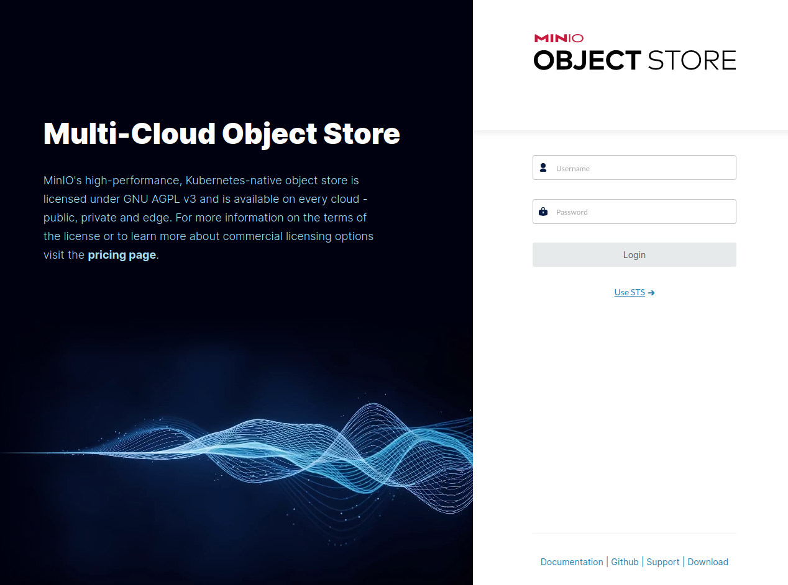
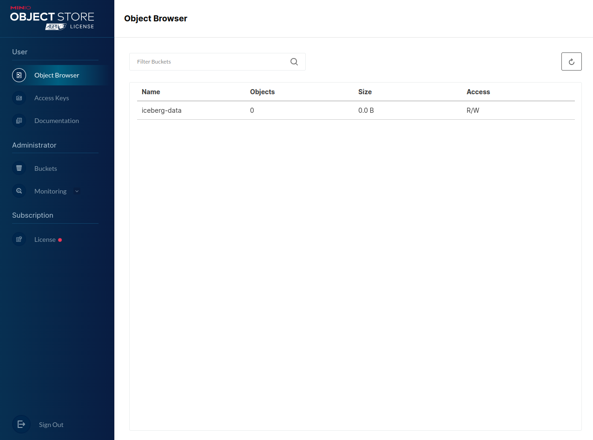
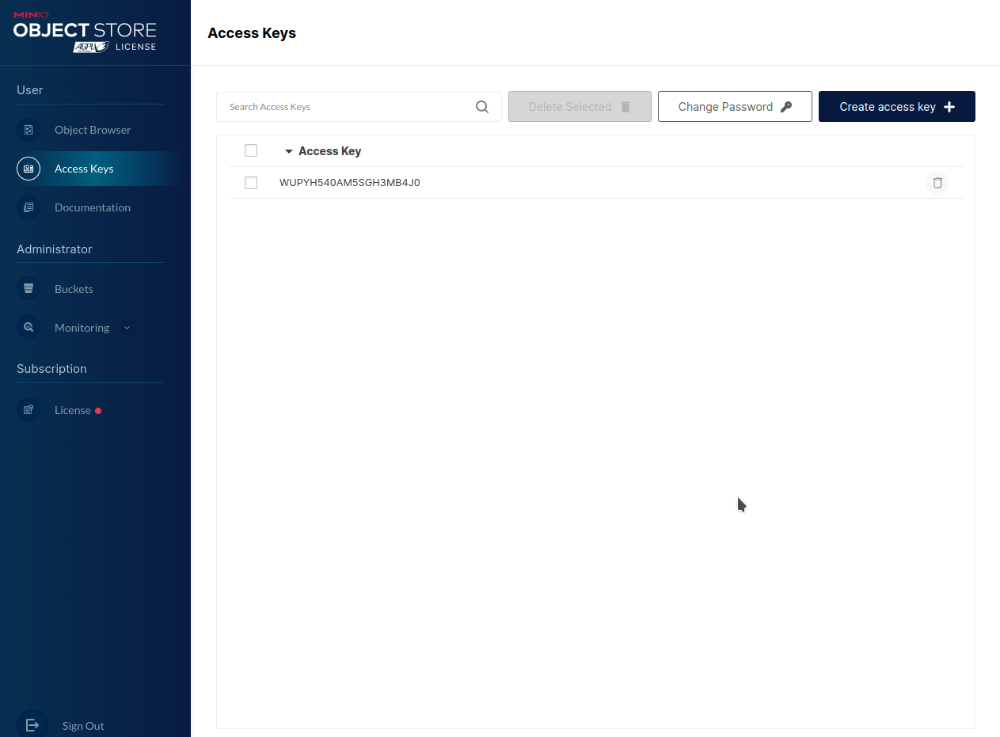
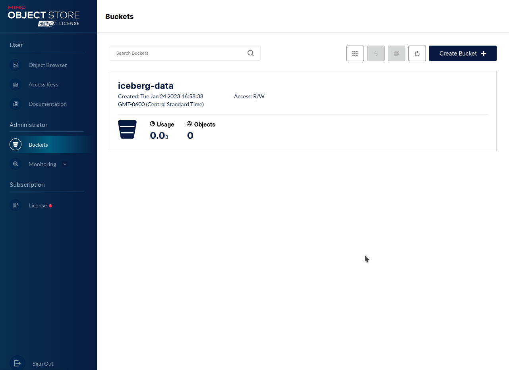
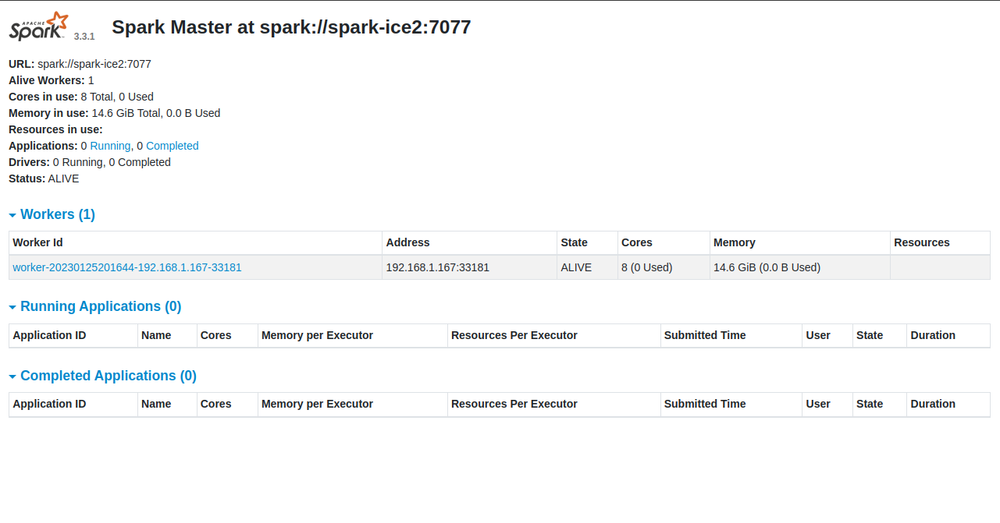
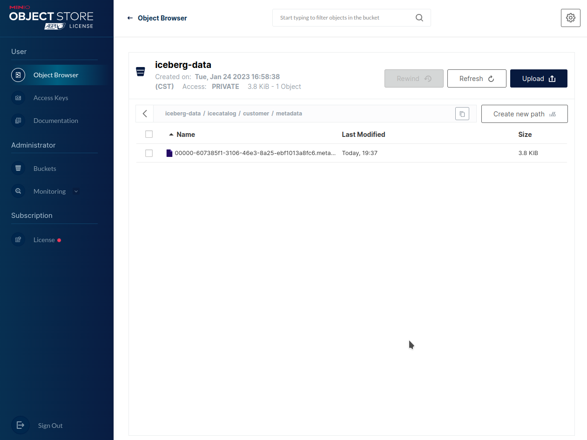

# Apache Iceberg Introduction Workshop

---

## Objective:

 * To evaluate Apache Iceberg with data stored in an S3a service (minio) on a traditional linux server.

My goal in this exercise was to go a little deeper than your typical `How To` guide that uses docker to spin up an enviroment. If that is what you are interested in the
[Apache Iceberg website](https://iceberg.apache.org/spark-quickstart/) has a great quickstart for that. It has been my experience that to truely understand how some technologies work you need to know how they are wired together.  I took the time to install all the components manually and then I built the setup script in this repo so others could try it out too.  Please take the time to review that script `setup_iceberg.sh`.  Hopefully it becomes a reference for you one day.

---

###  Pre-Requisites:

 * I built this on a new install of Ubuntu Server
 * Version: 20.04.5 LTS 
 * Instance Specs: (min 2 core w/ 4 GB ram & 20 GB of disk) -- add more RAM if you have it to spare.

---

###  Install Git tools and pull this repo.
*  ssh into your new Ubuntu 20.04 instance and run the below command:

---

```
sudo apt-get install git-all -y

cd ~
git clone https://github.com/tlepple/iceberg-intro-workshop.git
```

---


### Start the build:

####  This script will setup and confgure the following tools on this one host:
 - minio (local S3a Service) (RELEASE.2023-01-12T02-06-16Z )
 - minio cli  (version RELEASE.2023-01-11T03-14-16Z )
 - openjdk 11 (version: 11 )
 - aws cli (version 2.19.19)
 - postgresql (version: 14)
 - apache spark (version: 3.3_2.12)
 - apache iceberg (version 1.1.0)

---

```
#  run it:
. ~/iceberg-intro-workshop/setup_iceberg.sh
```
 * Refill your coffee, this will run for about 5 min.

---

### Run an aws cli command against our local minio server
 * all the aws s3 command work in this server.

```
aws --endpoint-url http://127.0.0.1:9000 s3 ls
```

#### Expected Output: The bucket name.
```
2023-01-24 22:58:38 iceberg-data
```
---

### Let's Explore Minio

Let's login into the minio GUI: navigate to `http:\\<host ip address>:9000` in a browser

  - Username: `icebergadmin`
  - Password: `supersecret1!`

---



---

`Object Browser` view with one bucket that was created during the install.  Bucket Name:  `iceberg-data`

---



---

Click on the tab `Access Keys` :  The key was created during the build too.

---



---

Click on the tab: `Buckets` 

---



---

### Start a standalone Spark Master Server 

```
cd $SPARK_HOME

. ./sbin/start-master.sh
```

---

### Start a Spark Worker Server 

```
. ./sbin/start-worker.sh spark://$(hostname -f):7077
```

---

###  Check that the Spark GUI is up:
 * navigate to `http:\\<host ip address>:8080` in a browser

---

### Sample view of Spark Master.

---



---

###  Initialize some variables that will be used when we start the Spark-SQL service

```
. ~/minio-output.properties

export AWS_ACCESS_KEY_ID=$access_key
export AWS_SECRET_ACCESS_KEY=$secret_key
export AWS_S3_ENDPOINT=127.0.0.1:9000
export AWS_REGION=us-east-1
export MINIO_REGION=us-east-1
export DEPENDENCIES="org.apache.iceberg:iceberg-spark-runtime-3.3_2.12:1.1.0"
export AWS_SDK_VERSION=2.19.19
export AWS_MAVEN_GROUP=software.amazon.awssdk
export AWS_PACKAGES=(
"bundle"
"url-connection-client"
)
for pkg in "${AWS_PACKAGES[@]}"; do
export DEPENDENCIES+=",$AWS_MAVEN_GROUP:$pkg:$AWS_SDK_VERSION"
done
```

###  Start the Spark-SQL client service:

```
cd $SPARK_HOME

spark-sql --packages $DEPENDENCIES \
--conf spark.sql.extensions=org.apache.iceberg.spark.extensions.IcebergSparkSessionExtensions \
--conf spark.sql.cli.print.header=true \
--conf spark.sql.catalog.icecatalog=org.apache.iceberg.spark.SparkCatalog \
--conf spark.sql.catalog.icecatalog.catalog-impl=org.apache.iceberg.jdbc.JdbcCatalog \
--conf spark.sql.catalog.icecatalog.uri=jdbc:postgresql://127.0.0.1:5432/icecatalog \
--conf spark.sql.catalog.icecatalog.jdbc.user=icecatalog \
--conf spark.sql.catalog.icecatalog.jdbc.password=supersecret1 \
--conf spark.sql.catalog.icecatalog.warehouse=s3://iceberg-data \
--conf spark.sql.catalog.icecatalog.io-impl=org.apache.iceberg.aws.s3.S3FileIO \
--conf spark.sql.catalog.icecatalog.s3.endpoint=http://127.0.0.1:9000 \
--conf spark.sql.catalog.sparkcatalog=org.apache.iceberg.spark.SparkSessionCatalog \
--conf spark.sql.defaultCatalog=icecatalog \
--conf spark.eventLog.enabled=true \
--conf spark.eventLog.dir=/opt/spark/spark-events \
--conf spark.history.fs.logDirectory=/opt/spark/spark-events \
--conf spark.sql.catalogImplementation=in-memory
```
---
####  Expected Output:
  *  the warnings can be ingored
```
23/01/25 19:48:19 WARN Utils: Your hostname, spark-ice2 resolves to a loopback address: 127.0.1.1; using 192.168.1.167 instead (on interface eth0)
23/01/25 19:48:19 WARN Utils: Set SPARK_LOCAL_IP if you need to bind to another address
:: loading settings :: url = jar:file:/opt/spark/jars/ivy-2.5.0.jar!/org/apache/ivy/core/settings/ivysettings.xml
Ivy Default Cache set to: /home/centos/.ivy2/cache
The jars for the packages stored in: /home/centos/.ivy2/jars
org.apache.iceberg#iceberg-spark-runtime-3.3_2.12 added as a dependency
software.amazon.awssdk#bundle added as a dependency
software.amazon.awssdk#url-connection-client added as a dependency
:: resolving dependencies :: org.apache.spark#spark-submit-parent-59d47579-1c2b-4e66-a92d-206be33d8afe;1.0
        confs: [default]
        found org.apache.iceberg#iceberg-spark-runtime-3.3_2.12;1.1.0 in central
        found software.amazon.awssdk#bundle;2.19.19 in central
        found software.amazon.eventstream#eventstream;1.0.1 in central
        found software.amazon.awssdk#url-connection-client;2.19.19 in central
        found software.amazon.awssdk#utils;2.19.19 in central
        found org.reactivestreams#reactive-streams;1.0.3 in central
        found software.amazon.awssdk#annotations;2.19.19 in central
        found org.slf4j#slf4j-api;1.7.30 in central
        found software.amazon.awssdk#http-client-spi;2.19.19 in central
        found software.amazon.awssdk#metrics-spi;2.19.19 in central
:: resolution report :: resolve 423ms :: artifacts dl 19ms
        :: modules in use:
        org.apache.iceberg#iceberg-spark-runtime-3.3_2.12;1.1.0 from central in [default]
        org.reactivestreams#reactive-streams;1.0.3 from central in [default]
        org.slf4j#slf4j-api;1.7.30 from central in [default]
        software.amazon.awssdk#annotations;2.19.19 from central in [default]
        software.amazon.awssdk#bundle;2.19.19 from central in [default]
        software.amazon.awssdk#http-client-spi;2.19.19 from central in [default]
        software.amazon.awssdk#metrics-spi;2.19.19 from central in [default]
        software.amazon.awssdk#url-connection-client;2.19.19 from central in [default]
        software.amazon.awssdk#utils;2.19.19 from central in [default]
        software.amazon.eventstream#eventstream;1.0.1 from central in [default]
        ---------------------------------------------------------------------
        |                  |            modules            ||   artifacts   |
        |       conf       | number| search|dwnlded|evicted|| number|dwnlded|
        ---------------------------------------------------------------------
        |      default     |   10  |   0   |   0   |   0   ||   10  |   0   |
        ---------------------------------------------------------------------
:: retrieving :: org.apache.spark#spark-submit-parent-59d47579-1c2b-4e66-a92d-206be33d8afe
        confs: [default]
        0 artifacts copied, 10 already retrieved (0kB/10ms)
23/01/25 19:48:20 WARN NativeCodeLoader: Unable to load native-hadoop library for your platform... using builtin-java classes where applicable
Setting default log level to "WARN".
To adjust logging level use sc.setLogLevel(newLevel). For SparkR, use setLogLevel(newLevel).
23/01/25 19:48:28 WARN HiveConf: HiveConf of name hive.stats.jdbc.timeout does not exist
23/01/25 19:48:28 WARN HiveConf: HiveConf of name hive.stats.retries.wait does not exist
23/01/25 19:48:31 WARN ObjectStore: Version information not found in metastore. hive.metastore.schema.verification is not enabled so recording the schema version 2.3.0
23/01/25 19:48:31 WARN ObjectStore: setMetaStoreSchemaVersion called but recording version is disabled: version = 2.3.0, comment = Set by MetaStore centos@127.0.1.1
Spark master: local[*], Application Id: local-1674676103468
spark-sql>

```
---

###  Let's do a cursory check

```
SHOW CURRENT NAMESPACE;
```

#### Expected Output:

```
icecatalog
Time taken: 2.692 seconds, Fetched 1 row(s)
```
---

###  Lab exercises begin here:
  * In this lab we will create our first iceberg table with `Spark-SQL`

### Start the `SparkSQL` cli tool
 * from a terminal prompt run:

---

### Create Tables:
  * These will be run in the spark-sql cli

```
# Create Customer table:
CREATE TABLE icecatalog.icecatalog.customer (
    first_name STRING,
    last_name STRING,
    street_address STRING,
    city STRING,
    state STRING,
    zip_code STRING,
    home_phone STRING,
    mobile STRING,
    email STRING,
    ssn STRING,
    job_title STRING,
    create_date STRING,
    cust_id BIGINT)
USING iceberg
OPTIONS (
    'write.object-storage.enabled'=true,
    'write.data.path'='s3://iceberg-data')
PARTITIONED BY (state);

# Create Transactions table:
CREATE TABLE icecatalog.icecatalog.transactions (
    transact_id STRING,
    transaction_date STRING,
    item_desc STRING,
    barcode STRING,
    category STRING,
    amount STRING,
    cust_id BIGINT)
USING iceberg
OPTIONS (
    'write.object-storage.enabled'=true,
    'write.data.path'='s3://iceberg-data');
```

---

###  Go examine the bucket in Minio from the GUI
---

---

###  Insert some records:
  *  In this step we will load up some json records from a file created during setup.
  *  We will create a temporary view against this json file and then load the file with an INSERT statement.
---

```
# Create temporary view statement:
CREATE TEMPORARY VIEW customerView
  USING org.apache.spark.sql.json
  OPTIONS (
    path "/opt/spark/input/customers.json"
  );

# Load the existing icegberg table (created earlier) with:
INSERT INTO icecatalog.icecatalog.customer 
    SELECT 
             first_name, 
             last_name, 
             street_address, 
             city, 
             state, 
             zip_code, 
             home_phone,
             mobile,
             email,
             ssn,
             job_title,
             create_date,
             cust_id
    FROM customerView;

```
---

### Let's Add and Update some rows with the `MERGE` Statement:

---

```
# Create temporary view statement:
CREATE TEMPORARY VIEW mergeCustomerView
  USING org.apache.spark.sql.json
  OPTIONS (
    path "/opt/spark/input/update_customers.json"
  );

# Merge records from a json file:  
MERGE INTO icecatalog.icecatalog.customer c
USING (SELECT  * FROM mergeCustomerView) mc
ON c.cust_id = mc.cust_id
WHEN NOT MATCHED THEN INSERT *;
```

---

###  Let's take a look at Time Travel Queries from this table:
  *  In order to run a time travel query we need some metadata to pass into our query.

This query will return some metadata from our database.
  *  your results will be slightly different.

```
SELECT 
     committed_at, 
     snapshot_id, 
     parent_id 
  FROM icecatalog.icecatalog.customer.snapshots
  ORDER BY committed_at;
```
---

#### Output:

```
committed_at    snapshot_id     parent_id
2023-01-25 20:25:17.453 3837599977712977637     NULL
2023-01-25 20:52:59.826 7079313749846172419     3837599977712977637
Time taken: 0.482 seconds, Fetched 2 row(s)
```

---

###  Query of the table after our first INSERT statement:
  *  replace thse snapshop id with your value:

```
SELECT * 
  FROM icecatalog.icecatalog.customer 
  VERSION AS OF 3837599977712977637
  ORDER by cust_id;
```

####  Output:

```
first_name      last_name       street_address  city    state   zip_code        home_phone      mobile  email   ssn     job_title       create_date     cust_id
Brenda  Thompson        321 Nicole Ports Suite 204      South Lisachester       AS      89409   486.884.6221x4431       (290)274-1564   wmoran@example.net      483-79-5404     Housing manager/officer 2022-12-25 01:10:43     10
Jennifer        Anderson        1392 Cervantes Isle     Adrianaton      IN      15867   939-630-6773    904.337.2023x17453      michaeltodd@example.com 583-07-6994     Clinical embryologist   2022-12-03 04:50:07     11
William Jefferson       543 Matthew Courts      South Nicholaston       WA      17687   +1-599-587-9051x2899    (915)689-1450   peterhouse@example.net  792-52-6700     Land    2022-11-28 08:17:10     12
Jack    Romero  5929 Karen Ridges       Lake Richardburgh       OR      78947   (402)664-1399x71255     450.580.6817x043        michellemitchell@example.net    216-24-7271     Engineer, building services     2022-12-11 19:09:30     13
Robert  Johnson 4313 Adams Islands      Tammybury       UT      07361   (477)888-9999   220-403-9274x9709       morrischristopher@example.com   012-26-8650     Rural practice surveyor 2022-12-08 05:28:56     14
Time taken: 0.697 seconds, Fetched 5 row(s)

```
---

### Query to get the results after the MERGE statement.
  *  replace thse snapshop id with your value:

```
SELECT * 
 FROM icecatalog.icecatalog.customer 
 VERSION AS OF 7079313749846172419
 ORDER by cust_id;
```

#### Output:

```
first_name      last_name       street_address  city    state   zip_code        home_phone      mobile  email   ssn     job_title       create_date     cust_id
Brenda  Thompson        321 Nicole Ports Suite 204      South Lisachester       AS      89409   486.884.6221x4431       (290)274-1564   wmoran@example.net      483-79-5404     Housing manager/officer 2022-12-25 01:10:43     10
Jennifer        Anderson        1392 Cervantes Isle     Adrianaton      IN      15867   939-630-6773    904.337.2023x17453      michaeltodd@example.com 583-07-6994     Clinical embryologist   2022-12-03 04:50:07     11
William Jefferson       543 Matthew Courts      South Nicholaston       WA      17687   +1-599-587-9051x2899    (915)689-1450   peterhouse@example.net  792-52-6700     Land    2022-11-28 08:17:10     12
Jack    Romero  5929 Karen Ridges       Lake Richardburgh       OR      78947   (402)664-1399x71255     450.580.6817x043        michellemitchell@example.net    216-24-7271     Engineer, building services     2022-12-11 19:09:30     13
Robert  Johnson 4313 Adams Islands      Tammybury       UT      07361   (477)888-9999   220-403-9274x9709       morrischristopher@example.com   012-26-8650     Rural practice surveyor 2022-12-08 05:28:56     14
Benjamin        Rocha   294 William Skyway      Fowlerville     WA      75495   001-476-468-4403x364    4731036956      fwhite@example.com      571-78-6278     Probation officer       2022-12-10 07:39:35     15
Jonathan        Lawrence        4610 Kelly Road Suite 333       Michaelfort     PR      03033   936.011.1602x5883       (577)016-2546x30390     raymisty@example.com    003-05-2317     Dancer  2022-11-27 23:44:14     16
Thomas  Taylor  51884 Kelsey Ridges Apt. 973    Lake Morgan     RI      36056   541-784-5497x32009      +1-337-857-9219x83198   vanggary@example.net    133-61-4337     Town planner    2022-12-07 12:33:45     17
Jeffrey Williamson      6094 Powell Passage     Stevenland      VT      88479   4172910794      494.361.3094x223        jwallace@example.com    512-84-0907     Clinical cytogeneticist 2022-12-13 16:58:43     18
Joseph  Mccullough      7329 Santiago Point Apt. 070    Reedland        MH      85316   (449)740-1390   (663)381-3306x19170     michellecain@example.com        605-84-9744     Seismic interpreter     2022-12-05 05:33:56     19
Evan    Kirby   95959 Brown Rue Apt. 657        Lake Vanessa    MH      92042   342-317-5803    185-084-4719x39341      tayloralexandra@example.org     264-14-4935     Interpreter     2022-12-20 14:23:43     20
Teresa  Pittman 3249 Danielle Parks Apt. 472    East Ryan       ME      33108   +1-814-789-0109x88291   (749)434-0916   hamiltondanielle@example.org    302-61-5936     Medical physicist       2022-12-26 05:14:24     21
Alicia  Byrd    1232 Jenkins Pine Apt. 472      Woodton NC      82330   001-930-450-7297x258    +1-968-526-2756x661     shelly47@example.net    656-69-9593     Therapist, art  2022-12-17 18:20:51     22
Kathleen        Ellis   935 Kristina Club       East Maryton    AK      86759   001-089-194-5982x828    127.892.8518    jacksonkaren@example.com        426-13-9463     English as a foreign language teacher   2022-12-08 04:01:44     23
Tony    Lee     830 Elizabeth Mill Suite 184    New Heather     UT      59612   001-593-666-0198        060.108.7218    vmayo@example.net       048-20-6647     Civil engineer, consulting      2022-12-24 17:10:32     24
Time taken: 0.571 seconds, Fetched 15 row(s)

```

---

### Exit out of `sparksql` cli.

```
exit;

```
---

### Let's try out `pyspark` and load our `Transactions` table with a pyspark dataFrame

---

###  Start `pyspark` cli

```
cd $SPARK_HOME
pyspark
```

---

#### Expected Output:

---

```
Python 3.8.10 (default, Nov 14 2022, 12:59:47) 
[GCC 9.4.0] on linux
Type "help", "copyright", "credits" or "license" for more information.
23/01/26 01:44:27 WARN Utils: Your hostname, spark-ice2 resolves to a loopback address: 127.0.1.1; using 192.168.1.167 instead (on interface eth0)
23/01/26 01:44:27 WARN Utils: Set SPARK_LOCAL_IP if you need to bind to another address
Setting default log level to "WARN".
To adjust logging level use sc.setLogLevel(newLevel). For SparkR, use setLogLevel(newLevel).
23/01/26 01:44:28 WARN NativeCodeLoader: Unable to load native-hadoop library for your platform... using builtin-java classes where applicable
Welcome to
      ____              __
     / __/__  ___ _____/ /__
    _\ \/ _ \/ _ `/ __/  '_/
   /__ / .__/\_,_/_/ /_/\_\   version 3.3.1
      /_/

Using Python version 3.8.10 (default, Nov 14 2022 12:59:47)
Spark context Web UI available at http://192.168.1.167:4040
Spark context available as 'sc' (master = local[*], app id = local-1674697469102).
SparkSession available as 'spark'.
>>> 

```

###  Let's run the following code.  

 * code blocks are commented:

---

```
# import SparkSession
from pyspark.sql import SparkSession

# create SparkSession
spark = SparkSession.builder \
     .appName("Python Spark SQL example") \
     .config("spark.jars.packages", "org.apache.iceberg:iceberg-spark-runtime-3.3_2.12:1.1.0,software.amazon.awssdk:bundle:2.19.19,software.amazon.awssdk:url-connection-client:2.19.19") \
     .config("spark.sql.extensions", "org.apache.iceberg.spark.extensions.IcebergSparkSessionExtensions") \
     .config("spark.sql.catalog.icecatalog", "org.apache.iceberg.spark.SparkCatalog") \
     .config("spark.sql.catalog.icecatalog.catalog-impl", "org.apache.iceberg.jdbc.JdbcCatalog") \
     .config("spark.sql.catalog.icecatalog.uri", "jdbc:postgresql://127.0.0.1:5432/icecatalog") \
     .config("spark.sql.catalog.icecatalog.jdbc.user", "icecatalog") \
     .config("spark.sql.catalog.icecatalog.jdbc.password", "supersecret1") \
     .config("spark.sql.catalog.icecatalog.warehouse", "s3://iceberg-data") \
     .config("spark.sql.catalog.icecatalog.io-impl", "org.apache.iceberg.aws.s3.S3FileIO") \
     .config("spark.sql.catalog.icecatalog.s3.endpoint", "http://127.0.0.1:9000") \
     .config("spark.sql.catalog.sparkcatalog", "icecatalog") \
     .config("spark.eventLog.enabled", "true") \
     .config("spark.eventLog.dir", "/opt/spark/spark-events") \
     .config("spark.history.fs.logDirectory", "/opt/spark/spark-events") \
     .config("spark.sql.catalogImplementation", "in-memory") \
     .getOrCreate()

# A JSON dataset is pointed to by path
path = "/opt/spark/input/transactions.json"

#  read json into the DataFrame
transactionsDF = spark.read.json(path)

# visualize the inferred schema
transactionsDF.printSchema()

# print out the dataframe in this cli
transactionsDF.show()

# Create a new table called 'icecatalog.icecatalog.transactions' from this DataFrame
transactionsDF.writeTo("icecatalog.icecatalog.transactions").append()

# stop the sparkSession
spark.stop()

# Exit out of the editor:
quit();

```
---

#### Expected Output:

---

```
>>> # import SparkSession
>>> from pyspark.sql import SparkSession
>>> 
>>> # create SparkSession
>>> spark = SparkSession.builder \
...      .appName("Python Spark SQL example") \
...      .config("spark.jars.packages", "org.apache.iceberg:iceberg-spark-runtime-3.3_2.12:1.1.0,software.amazon.awssdk:bundle:2.19.19,software.amazon.awssdk:url-connection-client:2.19.19") \
...      .config("spark.sql.extensions", "org.apache.iceberg.spark.extensions.IcebergSparkSessionExtensions") \
...      .config("spark.sql.catalog.icecatalog", "org.apache.iceberg.spark.SparkCatalog") \
...      .config("spark.sql.catalog.icecatalog.catalog-impl", "org.apache.iceberg.jdbc.JdbcCatalog") \
...      .config("spark.sql.catalog.icecatalog.uri", "jdbc:postgresql://127.0.0.1:5432/icecatalog") \
...      .config("spark.sql.catalog.icecatalog.jdbc.user", "icecatalog") \
...      .config("spark.sql.catalog.icecatalog.jdbc.password", "supersecret1") \
...      .config("spark.sql.catalog.icecatalog.warehouse", "s3://iceberg-data") \
...      .config("spark.sql.catalog.icecatalog.io-impl", "org.apache.iceberg.aws.s3.S3FileIO") \
...      .config("spark.sql.catalog.icecatalog.s3.endpoint", "http://127.0.0.1:9000") \
...      .config("spark.sql.catalog.sparkcatalog", "icecatalog") \
...      .config("spark.eventLog.enabled", "true") \
...      .config("spark.eventLog.dir", "/opt/spark/spark-events") \
...      .config("spark.history.fs.logDirectory", "/opt/spark/spark-events") \
...      .config("spark.sql.catalogImplementation", "in-memory") \
...      .getOrCreate()
23/01/26 02:04:13 WARN SparkSession: Using an existing Spark session; only runtime SQL configurations will take effect.
>>> 
>>> # A JSON dataset is pointed to by path
>>> path = "/opt/spark/input/transactions.json"
>>> 
>>> #  read json into the DataFrame
>>> transactionsDF = spark.read.json(path)
>>> 
>>> # visualize the inferred schema
>>> transactionsDF.printSchema()
root
 |-- amount: double (nullable = true)
 |-- barcode: string (nullable = true)
 |-- category: string (nullable = true)
 |-- cust_id: long (nullable = true)
 |-- item_desc: string (nullable = true)
 |-- transact_id: string (nullable = true)
 |-- transaction_date: string (nullable = true)

>>> 
>>> # print out the dataframe in this cli
>>> transactionsDF.show()
+------+-------------+--------+-------+--------------------+--------------------+-------------------+
|amount|      barcode|category|cust_id|           item_desc|         transact_id|   transaction_date|
+------+-------------+--------+-------+--------------------+--------------------+-------------------+
| 50.63|4541397840276|  purple|     10| Than explain cover.|586fef8b-00da-421...|2023-01-08 00:11:25|
| 95.37|2308832642138|   green|     10| Necessary body oil.|e8809684-7997-4cc...|2023-01-23 17:23:04|
|  9.71|1644304420912|    teal|     10|Recent property a...|18bb3472-56c0-48e...|2023-01-18 18:12:44|
| 92.69|6996277154185|   white|     10|Entire worry hosp...|a520859f-7cde-429...|2023-01-03 13:45:03|
| 21.89|7318960584434|  purple|     11|Finally kind coun...|3922d6a1-d112-411...|2022-12-29 09:00:26|
| 24.97|4676656262244|   olive|     11|Strong likely spe...|fe40fd4c-6111-49b...|2023-01-19 03:47:12|
| 68.98|2299973443220|    aqua|     14|Store blue confer...|331def13-f644-409...|2023-01-13 10:07:46|
|  66.5|1115162814798|  silver|     14|Court dog method ...|57cdb9b6-d370-4aa...|2022-12-29 06:04:30|
| 26.96|5617858920203|    gray|     14|Black director af...|9124d0ef-9374-441...|2023-01-11 19:20:39|
| 11.24|1829792571456|  yellow|     14|Lead today best p...|d418abe1-63dc-4ca...|2022-12-31 03:16:32|
|  6.82|9406622469286|    aqua|     15|Power itself job ...|422a413a-590b-4f7...|2023-01-09 19:09:29|
| 89.39|7753423715275|   black|     15|Material risk first.|bc4125fc-08cb-4ab...|2023-01-23 03:24:02|
| 63.49|2242895060556|   black|     15|Foreign strong wa...|ff4e4369-bcef-438...|2022-12-29 22:12:09|
|  49.7|3010754625845|   black|     15|  Own book move for.|d00a9e7a-0cea-428...|2023-01-12 21:42:32|
| 10.45|7885711282777|   green|     15|Without beat then...|33afa171-a652-429...|2023-01-05 04:33:24|
| 34.12|8802078025372|    aqua|     16|     Site win movie.|cfba6338-f816-4b7...|2023-01-07 12:22:34|
| 96.14|9389514040254|   olive|     16|Agree enjoy four ...|5223b620-5eef-4fa...|2022-12-28 17:06:04|
|  3.38|6079280166809|    blue|     16|Concern his debat...|33725df2-e14b-45a...|2023-01-17 20:53:25|
|  2.67|5723406697760|  yellow|     16|Republican sure r...|6a707466-7b43-4af...|2023-01-02 15:40:17|
| 68.85|0555188918000|   black|     16|Sense recently th...|5a31670b-9b68-43f...|2023-01-12 03:21:06|
+------+-------------+--------+-------+--------------------+--------------------+-------------------+
only showing top 20 rows

>>> transactionsDF.writeTo("icecatalog.icecatalog.transactions").append()
SLF4J: Failed to load class "org.slf4j.impl.StaticLoggerBinder".
SLF4J: Defaulting to no-operation (NOP) logger implementation
SLF4J: See http://www.slf4j.org/codes.html#StaticLoggerBinder for further details.
>>> spark.stop()                                                                
>>> quit();

```
